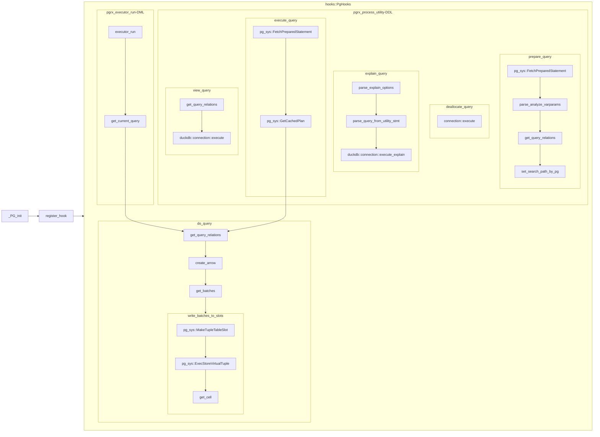

```mermaid
flowchart LR
_PG_init --> register_hook --> hooks::PgHooks
    subgraph hooks::PgHooks
        subgraph do_query
            direction TB
            get_query_relations --> create_arrow --> get_batches --> write_batches_to_slots
        end
        subgraph write_batches_to_slots
            direction TB
            pg_sys::MakeTupleTableSlot --> pg_sys::ExecStoreVirtualTuple --> get_cell
        end
        subgraph pgrx_executor_run-DML
            direction TB
            executor_run -->  get_current_query --> get_query_relations
        end
        
        subgraph pgrx_process_utility-DDL
            direction TB
            subgraph prepare_query
                direction TB
                pg_sys::FetchPreparedStatement --> parse_analyze_varparams --> pq1[get_query_relations] --> set_search_path_by_pg
            end
            subgraph execute_query
                direction TB
                eq[pg_sys::FetchPreparedStatement] --> pg_sys::GetCachedPlan --> get_query_relations
            end
            subgraph deallocate_query
                direction TB
                connection::execute
            end
            subgraph explain_query
                direction TB
                parse_explain_options --> parse_query_from_utility_stmt --> duckdb::connection::execute_explain
            end
            subgraph view_query
                direction TB
                vq[get_query_relations] --> duckdb::connection::execute
            end
        end
        
    end
    
  
```